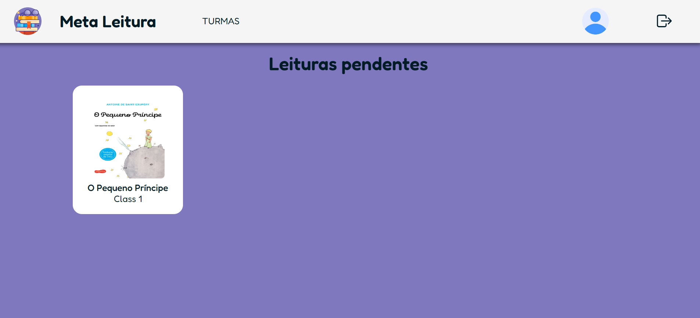
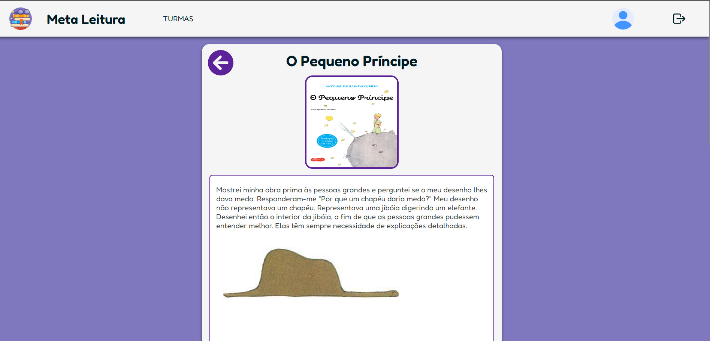
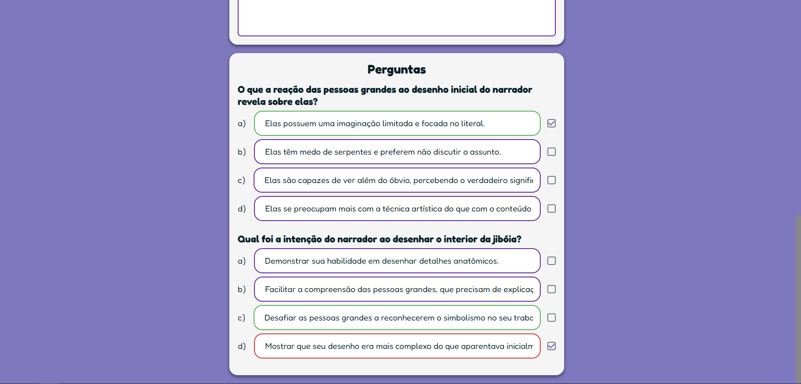
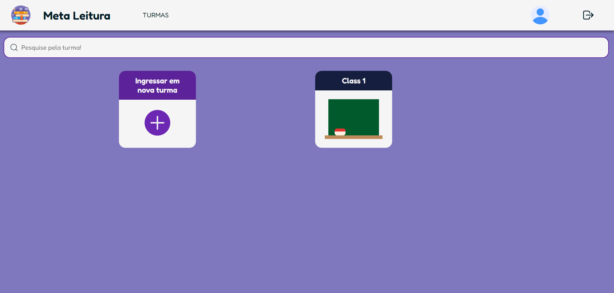
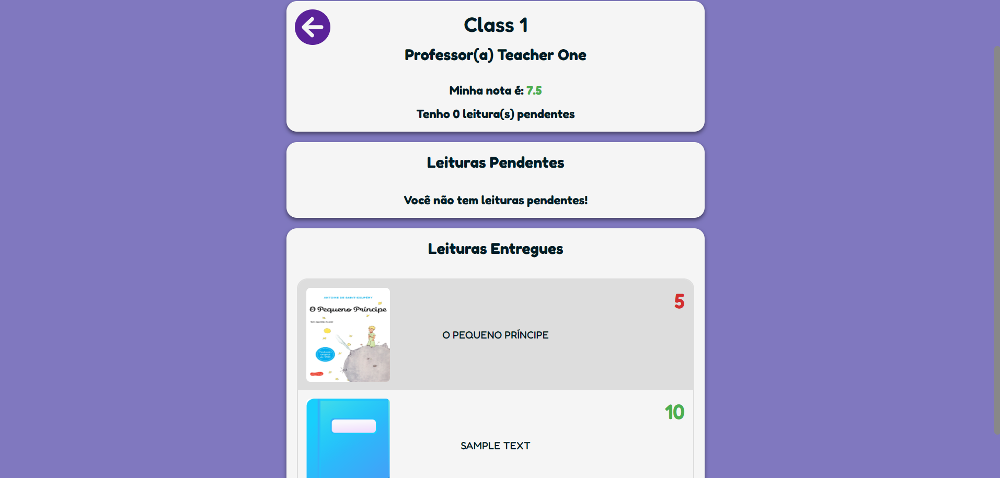

# Meta Reading 

Meta Reading is a social project developed as part of the Computer Science undergraduate course at UNIFESP. The project aims to enhance students' reading skills through a platform where teachers can upload texts and manage multiple classes with various students. Students must answer questions about the texts to earn grades and track their progress.

## Features 
 
- **Text Uploading** : Teachers can add various reading materials.
 
- **Class Management** : Create and manage multiple classes with different students.
 
- **Assessment** : Students answer questions about the texts to receive grades.

## Technologies Used 
 
- **Frontend** : Built with **Next.js 14**  using **Styled Components**  for styling.
 
- **Backend** : Utilizes the **APIs provided by Next.js 14**  for server-side logic.
 
- **Prisma** : ORM used for database interaction.
 
- **Docker** : Containerization tool to isolate the development environment.
 
- **ESLint** : Tool to ensure code quality and consistency.

## Screenshots

Here some exemples of how the project works:

### Login Page

### Student Home Page

### Student Task Part 1

### Student Task Part 2

### Student Class Page

### Student Class Details

### How to Run the Application Locally
After downloading the project file, run the command: npm install

Set up a PostgreSQL database with the latest version and modify the environment variables in the .env file to connect to it.
Run the sequence of commands to create tables and populate your database:
prisma migrate reset --force
prisma migrate dev --name init
prisma generate
node prisma/seed.js

Then, run de command: npm run dev

If you want to stop your database, in your command prompt as administrator (if you are running on Windows), run: net stop postgresql-x64-17
If you want to start your database, run: net start postgresql-x64-17